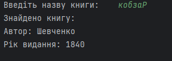

### Лабораторна робота №5. Файли. Потоки введення/виведення. 

# Завдання:
ВАРІАНТ 4
1) Напишіть програму, яка створить новий файл, що містить всі прості числа з заданого
файлу.
2) Дано файл, що містить відомості про книги: прізвище автора, назва і рік видання.
Визначити, чи є книга з заданою назвою. Якщо є, то повідомити прізвище автора та рік
видання. Якщо таких книг кілька, то повідомити дані про всі ці книги. Якщо таких книг
немає, то вивести відповідне повідомлення.
# 

# Результати виконання завдання 2

